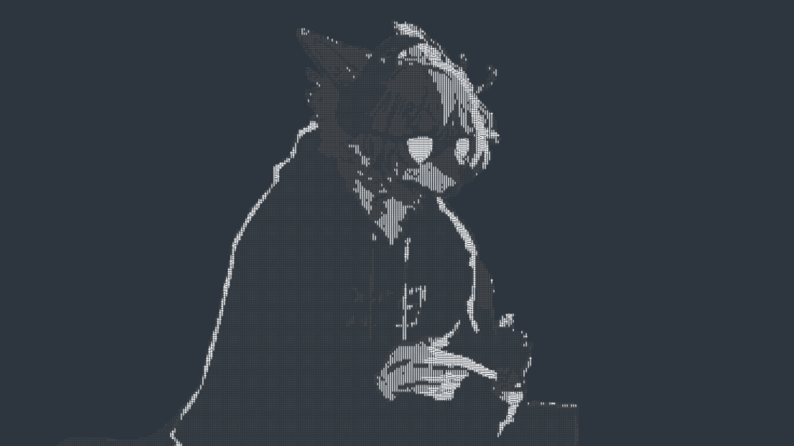

<p align="center">
  
</p>

<h1 align="center">omakase-unix-gnome</h1>

<p align="center">
  <b>お任せ</b> — <i>"I'll leave it up to you."</i><br/>
  One command. A unixporn·material <b>Fedora + GNOME</b> desktop, rebuilt from scratch:
  extensions, themes, terminal rice, "eternal-fedora" safeguards, and a boot menu
  that actually shows up.
</p>

<p align="center">
  
  
  
</p>

---

## What is this?

Omakase is a fully automated setup script. Run it once on a fresh Fedora
Workstation and it:

- installs and tunes **10 GNOME extensions** (Blur My Shell, Dash-to-Dock,
  ArcMenu, Just Perfection, User Themes, AppIndicator, Burn My Windows, Vitals,
  Grand Theft Focus, AlphabeticalAppGrid) with the exact golden settings,
- applies the **Graphite-Dark / Tela-circle-black** material look — GTK, shell,
  libadwaita, icons, cursors, Nerd Font — and your **unix-wolf** wallpaper,
- rices **kitty + fastfetch + starship**, with a fastfetch logo autogenerated
  from your own `assets/ascii-text.txt` (scaled to fit any resolution),
- hardens the box with the **eternal-fedora** playbook: dnf `keepcache`,
  security-only auto-updates, `fstrim`, btrfs **snapper** snapshots,
  **grub-btrfs** (boot any snapshot from the GRUB menu), and a **material GRUB
  (tela + wolf) whose menu is forced visible every boot**,
- installs the dev/productivity/gaming apps (Flathub) and pins the dock,
- backs up every touched config.

Re-running it is always safe — every step is idempotent.

## Requirements

| Thing       | Why                                              |
|-------------|--------------------------------------------------|
| Fedora 44+  | script uses `dnf`/`dnf5` and Fedora GRUB layout   |
| GNOME 48/50 | extension schemas are detected from your shell   |
| btrfs root  | snapper snapshots + grub-btrfs need it           |
| Internet    | themes, extensions, fonts, apps are downloaded   |
| `sudo`      | system steps prompt for your password            |

## Quick start

```bash
git clone https://github.com/arikcloss/omakase-unix-gnome.git
cd omakase-unix-gnome
./install.sh
```

Then log out and back in (extensions/themes activate), and reboot once to see the
new GRUB menu with its **Snapshots** submenu.

## What you get

### CLI toolbox
Kitty, fastfetch, starship, eza, bat, fzf, ripgrep, fd, zoxide, tldr, bottom,
lazygit, gh, sassc — installed via **Homebrew** when present, otherwise falling
back to **dnf**.

### Themes & look
Graphite-Dark (black + float, 10px rounds, libadwaita-linked), Tela-circle-black
icons, Graphite-Dark cursors, JetBrainsMono Nerd Font, and the wolf wallpaper
for the desktop (`unix_wolf.jpg`) plus a GRUB-optimized baseline JPEG
(`grub_unix_wolf.jpg`) for the boot menu background.

### GNOME extensions (GNOME 48/50)
| Extension                   | Effect                                        |
|-----------------------------|-----------------------------------------------|
| Blur My Shell               | translucent blur on panel / dash / overview   |
| Dash-to-Dock                | auto-hiding bottom dock                       |
| ArcMenu                     | macOS/WM-style app launcher (Fedora branding) |
| Just Perfection             | clean top bar, no canned buttons              |
| User Themes                 | applies Graphite-Dark to the shell            |
| AppIndicator                | tray icons                                    |
| Burn My Windows             | hexagon window open/close                     |
| Vitals                      | sensors in the panel                          |
| Grand Theft Focus           | blue focus border on active window            |
| AlphabeticalAppGrid         | sorted app grid                               |

### Terminal & prompt
- **kitty** — material blue-grey palette, 90% per-window transparency, split tabs,
  JetBrainsMono Nerd Font, set as the default terminal and pinned in the dock.
- **fastfetch** — two-tone wolf ASCII (white body, soft-grey glints) plus distro,
  kernel, DE, WM, CPU/GPU/mem/disk — privacy-first (no user/host/IP).
- **starship** — material prompt with per-language icons.
- **aliases** — `ls`/`ll`/`tree` (eza), `cat` (bat), `grep` (rg), `find` (fd),
  `fetch` (fastfetch); fzf + zoxide wired in.

### Eternal-Fedora safeguards
- `dnf.conf`: `keepcache=True` (offline rollback), 5 installed kernels,
  parallel downloads, GPG check.
- Security-only auto-updates daily (never reboots on its own) + `fstrim`.
- **snapper** btrfs snapshots for `/` and `/home`, auto-timeline
  (5/h 7/d 4/w 2/m).
- **grub-btrfs** — snapshot entries appear in the GRUB menu; boot any of them.
- **GRUB**: material `tela` theme + wolf background, `timeout_style=menu`,
  `menu_auto_hide` purged — **the menu shows on every boot**.

### Apps (Flathub)
VSCodium, Podman Desktop, GitHub Desktop, Obsidian, Discord, Telegram, Flatseal,
Extension Manager, Steam, Lutris, Heroic + MangoHud & gamescope Vulkan layers.

### Handy commands
`sysupdate` · `sysfix` · `sysclean` · `syssnap` · `sysrollback` ·
`sysupgrade-major <rel>` · `backup-dots` · `fetch`

## Options

| Flag                 | Effect                                        |
|----------------------|-----------------------------------------------|
| *(none)*             | install everything                            |
| `--no-flatpaks`      | skip the Flathub app layer                    |
| `--no-safeguards`    | skip snapper / GRUB / dnf system work         |
| `--no-extensions`    | skip GNOME extensions                         |
| `--no-themes`        | skip themes / wallpaper                        |
| `--no-configs`       | skip dotfiles & custom commands               |
| `--no-tools`         | skip the CLI toolbox                          |
| `--no-fonts`         | skip the Nerd Font                            |
| `--tools`, `--configs`, … | run **only** those steps                |

## Bring your own art

Drop your own files into `assets/` and re-run the installer:

- `assets/ascii-text.txt` → automatically scaled and two-tone shaded into the
  fastfetch logo (a fallback logo is used if missing).
- `assets/unix_wolf.jpg` → desktop wallpaper.
- `assets/grub_unix_wolf.jpg` → GRUB background. Full-HD sized and kept a
  **baseline (non-progressive) JPEG** so GRUB's decoder renders it reliably;
  falls back to `unix_wolf.jpg` (converted on the fly) if absent.

## Safety

- The script is **idempotent** — safe to run again any time.
- Every system step asks for your `sudo` password in the terminal.
- Point it at a VM or spare btrfs laptop first if you want to see the flow.
- A `backup-dots` snapshot of all touched configs lands in
  `~/Backups/dotfiles/` (never committed to this repo).

## Project layout

```
omakase-unix-gnome/
├── install.sh           # the whole installer (self-contained, idempotent)
├── assets/
│   ├── unix_wolf.jpg        # wallpaper
│   ├── grub_unix_wolf.jpg   # GRUB background (baseline JPEG, full-HD)
│   ├── ascii-text.txt       # your ASCII art -> fastfetch logo
│   └── ascii-art.txt        # earlier art source (legacy)
└── backups/             # local personal backups (gitignored)
```

## License

[MIT](LICENSE) — do whatever, make your desktop yours.